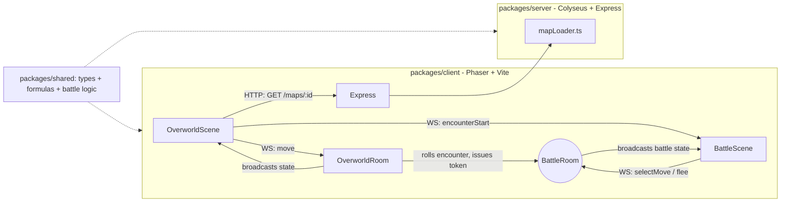

# Kanto MMO

An original, Pokémon-inspired massively-multiplayer 2D overworld RPG. This repo
contains the initial architecture and a first playable vertical slice: a
real-time multiplayer overworld where multiple players can walk around a
shared map and see each other move live.

## Project Vision

Kanto MMO reimagines the classic "collect creatures, explore routes, battle
trainers" formula as a persistent, authoritative multiplayer world instead of
a single-player cartridge game. Long term, the game will feature:

- A shared, persistent overworld with multiple maps/routes and warps.
- Wild creature encounters and turn-based PvE battles.
- An original roster of creatures, moves, and type effectiveness, built from
  scratch (see [Asset & Legal Policy](#asset--legal-policy) below).
- Player accounts, inventories, and progression (gyms/leagues or an
  original equivalent).
- PvP battles and trading between players.

This milestone builds on the foundation slice with **wild encounters and
turn-based PvE battles**: step onto a grass tile and you may be dropped into
a battle against a wild creature, fight it turn-by-turn with your starter
creature, and win XP (or lose and return to the overworld) — all resolved
authoritatively on the server.

## Asset & Legal Policy

**This project does not use, include, or derive from any Nintendo / Game
Freak / The Pokémon Company copyrighted assets** — no sprites, tilesets,
music, sound effects, map graphics, creature names, or verbatim data tables
are copied from Pokémon games or any decompilation project (such as
`pret/pokefirered`).

What *is* used as reference, and how:

- During development, the publicly available `pret/pokefirered`
  decompilation was consulted **read-only**, strictly to understand
  well-documented, genre-standard **game logic shapes** — e.g. "a damage
  formula takes attack/defense/power/level and produces a number", "a move
  has power/accuracy/pp/type/category", "species have base stats and a
  growth-rate curve". These are generic, long-standing RPG design patterns,
  not copyrightable expression.
- All actual code in this repository implementing that logic
  (`packages/shared/src/formulas.ts`, `typeChart.ts`, etc.) is original
  TypeScript, written from scratch.
- All creature names (e.g. *Tindle*, *Pondrake*, *Sproutling*), move names
  (e.g. *Ember Flick*, *Vine Snap*), and numeric game-balance values (base
  stats, move power/accuracy/pp, XP yields) are **original creations** for
  this project — see `packages/shared/src/species.ts` and `moves.ts`.
- All visuals in this milestone are **placeholder colored rectangles**
  (colored squares for players, colored tiles for terrain). No sprite or
  tileset image files are included anywhere in the repo.
- Placeholder content is designed to be easy to swap out later for fully
  original or licensed art/audio without changing the underlying data
  schemas.

If you fork or contribute to this project, please keep to this policy:
reference public, genre-standard mechanics conceptually; never copy
copyrighted assets, names, or literal data tables.

## Architecture Overview

This is a TypeScript monorepo using **npm workspaces**, with three packages:

```
packages/
  shared/   Framework-agnostic types, data, and formulas used by both
            client and server (Player/Creature/Move/Map/Battle types,
            damage calc, type effectiveness, XP curve, turn order/battle
            resolution, wild encounter rolling). Has its own vitest suite.
  server/   Authoritative Node.js game server, built on Colyseus. Hosts an
            OverworldRoom that tracks every connected player's position on
            a JSON-defined grid map, validates movement server-side, rolls
            wild encounters on grass tiles, and broadcasts state to all
            clients in real time. A BattleRoom resolves one-player-vs-one-
            wild-creature PvE battles (turn order, damage, win/loss, XP
            award). Also exposes a small Express HTTP API (health check +
            map data fetch). Has its own vitest suite.
  client/   Phaser 3 + Vite web client. Connects to the Colyseus server,
            renders the map as colored tiles and each player as a colored
            square, sends movement input from arrow keys / WASD, and shows
            a placeholder-art BattleScene (HP bars, move buttons, battle
            log) when an encounter is triggered.
```



Why this split: `shared` guarantees the client and server never disagree
about what a `Move`, `Species`, `MapTile`, or `BattleCreatureState` looks
like, or how damage/XP/turn order is calculated — there is exactly one
implementation of each formula, imported by both sides. The server never
trusts a client-chosen wild species/level for a battle: `OverworldRoom`
rolls the encounter and hands the client a single-use token that
`BattleRoom` validates before building battle state.

### Tech stack

- **TypeScript** everywhere, npm workspaces monorepo.
- **Client**: [Phaser 3](https://phaser.io/) for 2D tile rendering and input,
  [Vite](https://vitejs.dev/) for dev server/bundling, `colyseus.js` for
  networking.
- **Server**: [Colyseus](https://colyseus.io/) for authoritative real-time
  room state sync, Express for simple REST endpoints (health, map data).
- **Shared**: plain TypeScript types + pure functions, tested with
  [Vitest](https://vitest.dev/).
- **Lint/format**: ESLint (`@typescript-eslint`) + Prettier.

## Running Locally

Requires Node.js 18+ (tested with Node 22) and npm.

### 1. Install dependencies (once, from repo root)

```sh
npm install
```

### 2. Run tests & build everything

```sh
npm test            # runs shared's and server's vitest suites
npm run build        # builds shared -> server -> client in order
```

### 3. Start the server

```sh
npm run dev:server
```

This starts the Colyseus + Express server on `http://localhost:2567`
(WebSocket + HTTP on the same port). You should see:

```
Kanto MMO server listening on http://localhost:2567
```

### 4. Start the client

In a second terminal:

```sh
npm run dev:client
```

This starts the Vite dev server (default `http://localhost:5173`).

### 5. Test local multiplayer

Open `http://localhost:5173` in **two separate browser tabs** (or two
different browsers). Each tab joins the same `overworld` room as a
different trainer with a random name. Move one tab's player with the
**arrow keys or WASD** and you should see its colored square move in the
*other* tab in real time, and vice versa.

Movement is validated on the server: a player cannot walk through trees or
water tiles, even if a modified client tries to send bad input.

### 6. Trigger a wild encounter

Every player automatically gets a level-5 starter creature (in-memory only,
no persistence yet — see [ROADMAP.md](./ROADMAP.md) Milestone 3). Walk onto
any **grass** tile and there's a chance (server-rolled) of being dropped
into a battle against a random wild creature. Pick a move each turn; when
the battle ends (win, loss, or a successful flee) you're returned to the
overworld automatically. Winning awards XP and may level up your creature
(which also fully heals it).

### Environment variables (client)

The client defaults to connecting to `ws://localhost:2567` /
`http://localhost:2567`. Override via a `.env` file in `packages/client`:

```
VITE_SERVER_WS_URL=ws://your-server:2567
VITE_SERVER_HTTP_URL=http://your-server:2567
```

## What's in this milestone vs. what's next

See [ROADMAP.md](./ROADMAP.md) for the planned sequence of future
milestones (battles, inventory, PvP, trading, gyms/progression,
persistence, and larger world content).
