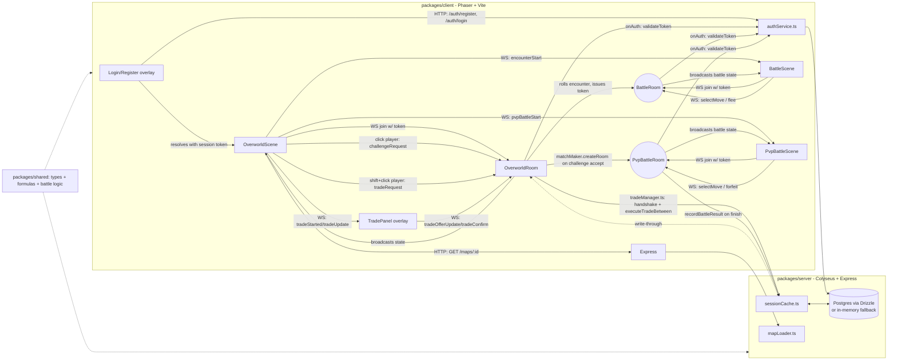

# Kanto MMO

An original, Pokémon-inspired massively-multiplayer 2D overworld RPG. This repo
contains the initial architecture and a first playable vertical slice: a
real-time multiplayer overworld where multiple players can walk around a
shared map and see each other move live.

## Project Vision

Kanto MMO reimagines the classic "collect creatures, explore routes, battle
trainers" formula as a persistent, authoritative multiplayer world instead of
a single-player cartridge game. Long term, the game will feature:

- A shared, persistent overworld with multiple maps/routes and warps.
- Wild creature encounters and turn-based PvE battles.
- An original roster of creatures, moves, and type effectiveness, built from
  scratch (see [Asset & Legal Policy](#asset--legal-policy) below).
- Player accounts, inventories, and progression (gyms/leagues or an
  original equivalent).
- PvP battles and trading between players.

This milestone (7) adds **a larger world**: the single test map is now five
interconnected maps (Hearthfield Town, Fernway Wood, and the three gym
towns) linked by warps, an original recurring rival ("Juno," three
escalating battles), an original minor-antagonist group (the "Murk Crew,"
a light 3-stage server-authoritative quest), 8 new original creature
species, and NPC dialogue/quest-log UI on the client. See the ROADMAP's
Milestone 7 entry for full details and the legal rationale behind every
invented name/character used.

## Asset & Legal Policy

**This project does not use, include, or derive from any Nintendo / Game
Freak / The Pokémon Company copyrighted assets** — no sprites, tilesets,
music, sound effects, map graphics, creature names, or verbatim data tables
are copied from Pokémon games or any decompilation project (such as
`pret/pokefirered`).

What *is* used as reference, and how:

- During development, the publicly available `pret/pokefirered`
  decompilation was consulted **read-only**, strictly to understand
  well-documented, genre-standard **game logic shapes** — e.g. "a damage
  formula takes attack/defense/power/level and produces a number", "a move
  has power/accuracy/pp/type/category", "species have base stats and a
  growth-rate curve". These are generic, long-standing RPG design patterns,
  not copyrightable expression.
- All actual code in this repository implementing that logic
  (`packages/shared/src/formulas.ts`, `typeChart.ts`, etc.) is original
  TypeScript, written from scratch.
- All creature names (e.g. *Tindle*, *Pondrake*, *Sproutling*), move names
  (e.g. *Ember Flick*, *Vine Snap*), item names (e.g. *Herb Wrap*, *Rusty
  Snare*), and numeric game-balance values (base stats, move power/
  accuracy/pp, XP yields, catch rates, prices) are **original creations**
  for this project — see `packages/shared/src/species.ts`, `moves.ts`, and
  `items.ts`.
- Milestone 7's world/characters (map names *Hearthfield*, *Fernway Wood*,
  *Stonehollow*, *Tidemoor*, *Cinderfell*; the rival *Juno*; the
  antagonist group the *Murk Crew* and its members *Shade*, *Murk Crew
  Lookout/Scout/Grunt*) are likewise original creations invented for this
  project. They intentionally share the same *general structural shape* as
  a classic monster-collecting journey (starting town → forest route →
  gym towns → a recurring rival → a recurring antagonist team) — a
  long-standing, genre-generic story structure, not copyrightable
  expression — but every name, personality, motif, and line of dialogue is
  original and shares no overlap with any Pokémon game, anime episode, or
  character.
- All visuals in this milestone are **placeholder colored rectangles**
  (colored squares for players, colored tiles for terrain). No sprite or
  tileset image files are included anywhere in the repo.
- Placeholder content is designed to be easy to swap out later for fully
  original or licensed art/audio without changing the underlying data
  schemas.

If you fork or contribute to this project, please keep to this policy:
reference public, genre-standard mechanics conceptually; never copy
copyrighted assets, names, or literal data tables.

## Architecture Overview

This is a TypeScript monorepo using **npm workspaces**, with three packages:

```
packages/
  shared/   Framework-agnostic types, data, and formulas used by both
            client and server (Player/Creature/Move/Map/Battle types,
            damage calc, type effectiveness, XP curve, turn order/battle
            resolution, wild encounter rolling). Has its own vitest suite.
  server/   Authoritative Node.js game server, built on Colyseus. Hosts one
            OverworldRoom instance per map (five JSON-defined maps, routed
            via Colyseus `filterBy(['mapId'])`) that tracks every connected
            player's position, validates movement server-side, rolls wild
            encounters on grass tiles, handles warp-tile map transitions,
            NPC dialogue/quest-stage interactions, gym/rival/grunt trainer
            gate battles, offers a shop on `shop` tiles, handles server-
            authoritative inventory/currency mutations, handles PvP
            challenge requests/responses, and handles trade requests/
            negotiation/atomic execution between two players, broadcasting
            state to all clients in real time. A BattleRoom resolves one-
            player-vs-one-wild-creature PvE battles (turn order, damage,
            win/loss, XP award, item use incl. the catch mechanic); a
            TrainerBattleRoom resolves gym/rival/grunt trainer battles
            (multi-creature team auto-advance, badge/quest-stage award);
            a PvpBattleRoom resolves two-human-controlled battles (turn
            order, damage, win/loss, win/loss record persistence, turn
            timeout/forfeit). A Drizzle/PostgreSQL-backed persistence layer
            durably stores accounts, sessions, each player's party/
            position/map/win-loss record/badges/quest stage, and
            inventory/currency/storage, fronted by a write-through
            in-memory cache for low-latency reads during gameplay. Also
            exposes a small Express HTTP API (health check, map data
            fetch, current-map resolution, /auth/register, /auth/login).
            Has its own vitest suite.
  client/   Phaser 3 + Vite web client. Shows a DOM login/register overlay
            before connecting, then connects to the Colyseus server,
            renders the current map as colored tiles and each player as a
            colored square (click to send a PvP challenge, shift+click to
            send a trade request), sends movement input from arrow keys /
            WASD, switches rooms/maps on a warp-tile trigger, shows NPC/
            trainer markers with name labels, a DOM dialogue box for NPC
            conversations, a toggleable (`Q` key) quest-log panel, and a
            placeholder-art BattleScene (HP bars, move buttons, item menu,
            battle log) shared by wild encounters, trainer battles, and
            PvpBattleScene for player-vs-player battles. An inventory panel
            overlay (`I` key), a shop overlay (auto-shown on the shop
            tile), and a trade negotiation panel (opened on trade accept)
            round out the item/trading UI.
```



Why this split: `shared` guarantees the client and server never disagree
about what a `Move`, `Species`, `MapTile`, or `BattleCreatureState` looks
like, or how damage/XP/turn order is calculated — there is exactly one
implementation of each formula, imported by both sides. The server never
trusts a client-chosen wild species/level for a battle: `OverworldRoom`
rolls the encounter and hands the client a single-use token that
`BattleRoom` validates before building battle state. For PvP, `OverworldRoom`
itself creates the `PvpBattleRoom` via `matchMaker.createRoom` once both
sides accept a challenge, specifying each side's exact account id — so a
modified client can't fabricate a match or impersonate an opponent.
Likewise, no room trusts a client-supplied identity: every join is
authenticated via a server-issued session token (`onAuth` → `validateToken`),
and the resulting `accountId` is the only identity used to load/save a
player's party, position, and win/loss record. For trading, `OverworldRoom`
re-validates both sides' live, server-cached inventory/party ownership
immediately before executing a swap (never trusting the client's displayed
offer state), so a trade can't duplicate or lose items/creatures even if a
client is modified.

### Tech stack

- **TypeScript** everywhere, npm workspaces monorepo.
- **Client**: [Phaser 3](https://phaser.io/) for 2D tile rendering and input,
  [Vite](https://vitejs.dev/) for dev server/bundling, `colyseus.js` for
  networking, plus a small DOM-based login/register overlay (no extra UI
  framework needed for this).
- **Server**: [Colyseus](https://colyseus.io/) for authoritative real-time
  room state sync, Express for simple REST endpoints (health, map data,
  auth), [Drizzle ORM](https://orm.drizzle.team/) + `postgres` (postgres.js)
  for persistence, Node's built-in `crypto.scrypt` for password hashing.
- **Shared**: plain TypeScript types + pure functions, tested with
  [Vitest](https://vitest.dev/).
- **Lint/format**: ESLint (`@typescript-eslint`) + Prettier.

### Database choice & rationale

**PostgreSQL via [Drizzle ORM](https://orm.drizzle.team/)** (not Prisma,
not MongoDB). Why:

- The relational shape here (accounts → sessions, accounts → one player →
  many party members) maps cleanly onto normalized tables with foreign
  keys; there's no document-shaped data that would benefit from MongoDB's
  schema flexibility.
- Drizzle + the `postgres` driver are **pure JavaScript/TypeScript with no
  native binaries or code-generation step**. Prisma requires downloading a
  platform-specific native query-engine binary during `prisma generate` /
  install, which is a real reliability risk in sandboxed, offline, or
  locked-down CI/dev environments — Drizzle has no equivalent step.
- Drizzle's migrations are plain, reviewable `.sql` files generated from a
  TypeScript schema (`packages/server/src/db/schema.ts`), which keeps the
  schema readable and diffable in PRs.
- A `PersistenceStore` interface (`packages/server/src/persistence/types.ts`)
  decouples all game/auth logic from Drizzle/Postgres specifically: a
  zero-dependency `InMemoryPersistenceStore` implements the exact same
  contract, so **unit tests and a no-setup local dev run never require a
  live database** — the server automatically falls back to the in-memory
  store (with a console warning) whenever `DATABASE_URL` isn't set.

## Database Setup

By default (no `DATABASE_URL` set) the server runs against an **in-memory
store** — zero setup, but all accounts/parties/positions are lost on
restart. For durable storage, run Postgres locally via Docker:

### 1. Start Postgres

```sh
docker compose up -d
```

This starts a `postgres:16-alpine` container (`docker-compose.yml` at the
repo root) on `localhost:5432` with user/password/db `kanto`/`kanto`/
`kanto_mmo`.

### 2. Configure the server's environment

```sh
cp packages/server/.env.example packages/server/.env
```

The default `.env.example` already matches the docker-compose credentials
above; edit `DATABASE_URL` if you're pointing at a different Postgres
instance.

### 3. Run migrations

```sh
npm run db:migrate -w packages/server
```

This applies `packages/server/drizzle/*.sql` (generated from
`packages/server/src/db/schema.ts`) to create the `accounts`, `sessions`,
`players`, `party_members`, `inventory_items`, and `storage_members`
tables. If you change the schema later, regenerate the migration first
with:

```sh
npm run db:generate -w packages/server
```

### 4. Start the server as usual

```sh
npm run dev:server
```

With `DATABASE_URL` set (via the `.env` file, loaded automatically), the
server now persists everything to Postgres instead of memory. Restarting
the server — or reconnecting from a different machine — resumes exactly
where a player left off.

## Running Locally

Requires Node.js 18+ (tested with Node 22) and npm.

### 1. Install dependencies (once, from repo root)

```sh
npm install
```

### 2. Run tests & build everything

```sh
npm test            # runs shared's and server's vitest suites
npm run build        # builds shared -> server -> client in order
```

### 3. Start the server

```sh
npm run dev:server
```

This starts the Colyseus + Express server on `http://localhost:2567`
(WebSocket + HTTP on the same port). You should see:

```
Kanto MMO server listening on http://localhost:2567
```

### 4. Start the client

In a second terminal:

```sh
npm run dev:client
```

This starts the Vite dev server (default `http://localhost:5173`).

### 5. Register an account and test local multiplayer

Open `http://localhost:5173` in **two separate browser tabs** (or two
different browsers). Each tab shows a login/register overlay first —
register a new account in each tab (they need different emails), then
you'll be dropped into the shared `overworld` room as your trainer. Move
one tab's player with the **arrow keys or WASD** and you should see its
colored square move in the *other* tab in real time, and vice versa.

Movement is validated on the server: a player cannot walk through trees or
water tiles, even if a modified client tries to send bad input.

### 6. Trigger a wild encounter

Registering creates a level-5 starter creature for your account,
**persisted** to the database (or the in-memory store if `DATABASE_URL`
isn't set — see [Database Setup](#database-setup) above). Walk onto any
**grass** tile and there's a chance (server-rolled) of being dropped into a
battle against a random wild creature. Pick a move each turn; when the
battle ends (win, loss, or a successful flee) you're returned to the
overworld automatically. Winning awards XP and may level up your creature
(which also fully heals it).

### 7. Challenge another player to PvP

With both tabs logged in as different accounts and visible in the same
overworld, **click the other tab's colored player rectangle** to send a PvP
challenge. The target sees an accept/decline prompt (auto-declines after 20
seconds if ignored). On accept, both tabs transition into a PvP battle using
each player's persisted party (first living creature — see
[ROADMAP.md](./ROADMAP.md)'s Milestone 4 entry for why single-creature
rather than full-party). Pick a move each turn; after you submit, your move
buttons disable with a "waiting for opponent..." indicator until the
opponent also submits (or 30 seconds pass and they auto-forfeit). On battle
end, both tabs show the updated win/loss record and return to the
overworld.

### 8. Buy, use, and catch items

Walk to the **shop tile** near the middle of the map (a different color
from the surrounding path) to open a buy overlay — you start with 300
currency and a small starter inventory. Press **`I`** at any time to open
your inventory panel and use a healing or stat-boost item on a party
creature. During a wild battle, open the new **Items** button to use a
healing item on your active creature or a catching tool on the wild
creature — the catch chance is higher the lower the wild creature's
remaining HP and the stronger the tool (see
[ROADMAP.md](./ROADMAP.md)'s Milestone 2 entry for the exact formula). A
successful catch adds the creature to your party (or to overflow storage
if your party of 6 is full).

### 9. Test reconnect / persistence

Close the browser tab (or just reload it) after moving around and winning
a battle, then reopen `http://localhost:5173`. The cached session token in
`localStorage` lets you skip the login screen and resume at your last
position with your current party XP/level, win/loss record, and inventory/
currency/catches all intact. To force a fresh login, clear site data /
local storage for `localhost:5173`, or use a private window.

### 10. Trade with another player

With both tabs logged in as different accounts and visible in the same
overworld, **shift+click the other tab's colored player rectangle** (a
plain click still sends a PvP challenge) to send a trade request. The
target sees an accept/decline prompt (auto-declines after 20 seconds if
ignored, same as PvP). On accept, both tabs open a trade negotiation panel:
pick quantities of items and/or tick party/storage creatures to offer, then
click **Confirm**. Changing your offer after confirming (or the other side
changing theirs) resets both sides' confirmation, so there's no way to be
surprised by a last-second change. Once both sides are confirmed, the
server re-validates both sides still own what they offered and executes an
atomic swap — both tabs show the updated inventory/party immediately.
Reload both tabs afterward to confirm the swapped items/creatures persisted
on the correct account.

### 11. Battle a gym trainer and earn a badge

Three themed NPC trainers are placed on the map: **Garrick the Stonewarden**
(Rock-type, near the top grass ring), **Lira the Tideglass** (Water-type,
left path corridor), and **Kellan the Cinderguard** (Fire-type, right path
corridor) — each rendered as a distinct colored marker with a name/type
label. Walking onto a trainer's own tile before you've earned their badge
intercepts your movement and starts a mandatory battle instead (no flee
option, same turn-based UI as a wild battle but showing the trainer's name
and which of their team's creatures is currently active). Win, and you're
awarded a badge — the HUD's badge counter increments, and that trainer's
tile becomes ordinary walkable terrain from then on (no rematch). Note the
Stonewarden's Rock-typing resists the starter's Fire-type moves by design
(the map's intentional "first gym" difficulty spike), so grinding a few
wild-encounter levels above the trainer's own level-9/11 team first is
recommended. Reload the tab afterward to confirm the badge persisted and
the gate stayed open. A scripted end-to-end run of this whole flow (gate
trigger → grind → win → badge → reconnect) lives in
`packages/server/scripts/smoke-trainer.mjs` (`node
packages/server/scripts/smoke-trainer.mjs` against a running dev server).

### 12. Explore the wider world, meet Juno, and follow the Murk Crew thread

The world is now five maps: **Hearthfield Town** (start), **Fernway Wood**
(forest route, east of Hearthfield), and the three gym towns
**Stonehollow**, **Tidemoor**, and **Cinderfell**, linked by warp tiles —
walk onto one and you'll transition into the next map automatically (no
loading screen needed; it's a plain room switch). Bump into an NPC (a
gray or gold square with a name label) to open a dialogue box; press `Q`
to toggle the quest-log panel showing your current Murk Crew quest stage.
Juno, your rival (a green marker), appears once per gym town and will
challenge you to a battle every time, with a tougher team each visit. The
Murk Crew (dark-purple markers) block the Fernway Wood path and later
appear near Tidemoor/Cinderfell; defeating both Fernway lookouts advances
the quest automatically, while the Tidemoor beat requires defeating the
lure thief *and* walking the recovered lure back to the fisherman NPC to
turn it in. Reconnect at any point to confirm your current map, badges,
and quest stage all persisted correctly.

### Environment variables (client)

The client defaults to connecting to `ws://localhost:2567` /
`http://localhost:2567`. Override via a `.env` file in `packages/client`:

```
VITE_SERVER_WS_URL=ws://your-server:2567
VITE_SERVER_HTTP_URL=http://your-server:2567
```

## What's in this milestone vs. what's next

See [ROADMAP.md](./ROADMAP.md) for the planned sequence of future
milestones (larger world content and beyond).

## Note: battle "blackout" now fully heals instead of permanently fainting

While building this milestone's mandatory, no-flee trainer gate, testing
surfaced a pre-existing bug: with only one party member, losing *any*
battle (wild, trainer, or PvP) previously left that creature permanently
at 0 HP — and since healing items intentionally can never revive a fainted
creature, there was no way to ever battle again. This is now fixed:
losing a battle fully heals your active creature server-side (the
"blackout and stumble back to safety" message now matches what actually
happens), while item-based healing's "can't revive a fainted creature"
behavior is unchanged. See `reviveToFullInstance` in
`packages/shared/src/inventory.ts`.
